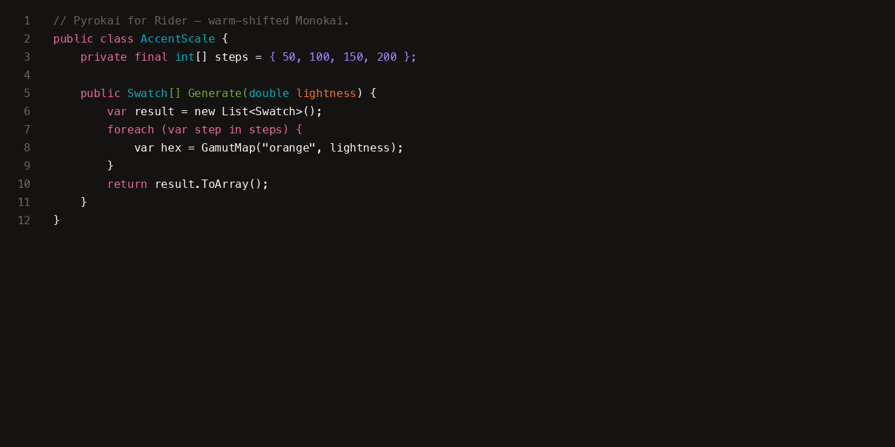

# Pyrokai for JetBrains IDEs

Monokai's accent family, warm-shifted, expanded into a Flexoki-shaped tonal system. Eight
hues × thirteen steps over a fifteen-step near-monochrome base — generated in OKLCH,
gamut-mapped to sRGB.

Adds **Pyrokai Dark** and **Pyrokai Light** editor color schemes to any JetBrains IDE
(Rider, IntelliJ IDEA, WebStorm, PyCharm, etc).



## Install

Settings → Plugins → Marketplace → search "Pyrokai" → Install. Then select the scheme
under Settings → Editor → Color Scheme.

## Development

```
export JAVA_HOME=<a JDK 17+ install>
./gradlew buildPlugin     # builds build/distributions/pyrokai-*.zip
./gradlew verifyPlugin    # runs the JetBrains Plugin Verifier
./gradlew runIde          # launches a sandbox IDE with the plugin installed
```

The color schemes themselves live in `src/main/resources/colorSchemes/` and are declared
via the `com.intellij.bundledColorScheme` extension point in `src/main/resources/META-INF/plugin.xml`.

## More

Pyrokai also has ready-made themes for VS Code, Xcode, Visual Studio, TextMate, iTerm2,
Terminal.app, Windows Terminal, Ghostty, Slack, Obsidian, Claude Code, and Codex — see the
[full project](https://patrickserrano.github.io/pyrokai/) for the complete palette and
install instructions for every app.

---

Made by [Patrick Serrano](https://patrickserrano.com) at [Pixelfox Studio](https://pixelfoxstudio.com).
