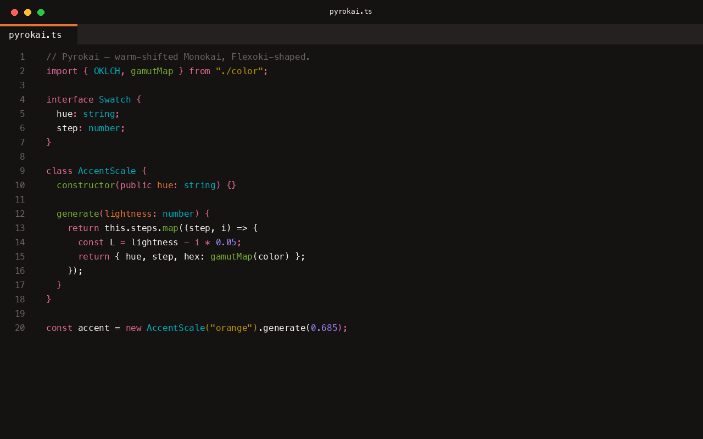
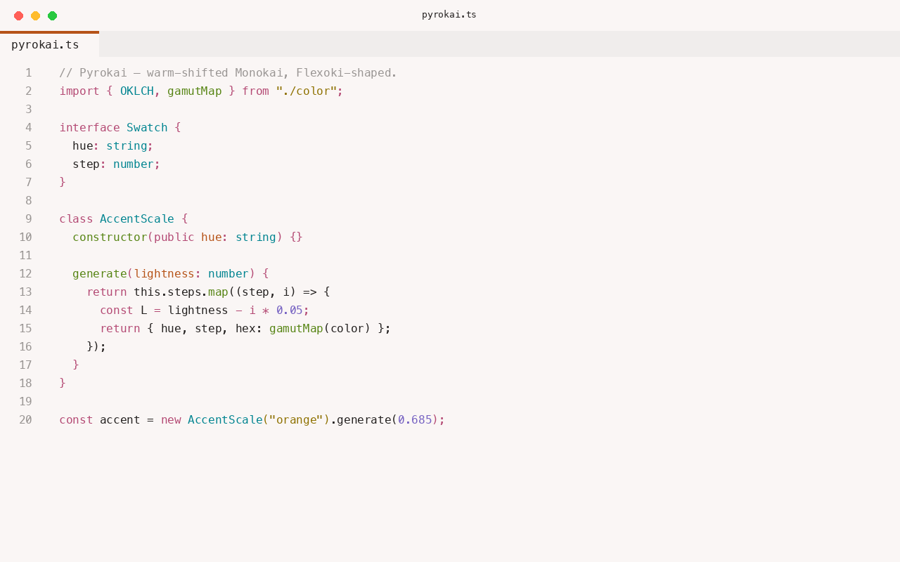

# Pyrokai

Monokai's accent family, warm-shifted, expanded into a Flexoki-shaped tonal system. Eight
hues × thirteen steps over a fifteen-step near-monochrome base — generated in OKLCH,
gamut-mapped to sRGB.

Includes **Pyrokai Dark** and **Pyrokai Light**.




## Install

Search for "Pyrokai" in the Extensions view (`Cmd+Shift+X` / `Ctrl+Shift+X`), or run:

```
ext install patrickserrano.pyrokai
```

Then pick **Pyrokai Dark** or **Pyrokai Light** from the color theme picker
(`Cmd+K Cmd+T` / `Ctrl+K Ctrl+T`).

## More

Pyrokai also has ready-made themes for Xcode, JetBrains Rider, Visual Studio, TextMate,
iTerm2, Terminal.app, Windows Terminal, Ghostty, Slack, Obsidian, Claude Code, and Codex —
see the [full project](https://patrickserrano.github.io/pyrokai/) for the complete palette
and install instructions for every app.

---

Made by [Patrick Serrano](https://patrickserrano.com) at [Pixelfox Studio](https://pixelfoxstudio.com).
